# Court Case Backlog Prioritizer

## Problem Statement
India’s judicial system is currently facing a crisis of **over 50 million pending cases** across district courts, High Courts, and the Supreme Court.  

This backlog has far-reaching consequences:  
- **Citizens**: Undertrials remain in jail for years without judgment.  
- **Families**: Property and inheritance disputes drag on for decades.  
- **Businesses**: Commercial disputes slow down the ease of doing business and discourage investment.  

Even with digital initiatives like **eCourts** and the **National Judicial Data Grid (NJDG)**, the system still lacks a **data-driven mechanism to decide which cases should be fast-tracked**. Currently, most cases are processed in chronological order, which ignores case complexity, urgency, or societal impact.  

This creates systemic inefficiency and denial of timely justice, making backlog reduction one of the most **complex but critical problems** in India’s governance.

---

## Solution Overview
Our proposed solution, the **Court Case Backlog Prioritizer**, is a **decision-support tool** that helps the judiciary prioritize cases intelligently.  

By analyzing case metadata and applying machine learning, the system can:  
- **Predict case duration and complexity**.  
- **Rank cases by urgency and impact**.  
- **Recommend priority scheduling** for judges and court administrators.  

### Workflow Diagram

```mermaid
flowchart LR
    subgraph Input["📥 Data Sources"]
        A["NJDG & eCourts<br/>Court Records"]
    end
    
    subgraph Process["⚙️ Processing"]
        B["Data Ingestion<br/>& Cleaning"]
        C["Feature Engineering<br/>Case Attributes"]
    end
    
    subgraph AI["🤖 Intelligence"]
        D["ML Model<br/>Duration & Complexity<br/>Prediction"]
    end
    
    subgraph Priority["🎯 Prioritization"]
        E["Ranking Engine<br/>Multi-Factor Scoring"]
    end
    
    subgraph Output["📊 Dashboard"]
        F["Interactive Dashboard<br/>Top Priority Cases<br/>Analytics & Insights"]
    end
    
    subgraph Users["👥 Users"]
        G["Judges & Court<br/>Administration"]
    end
    
    A --> B
    B --> C
    C --> D
    D --> E
    E --> F
    F --> G
    
    style Input fill:#e3f2fd,stroke:#1976d2,stroke-width:2px
    style Process fill:#f3e5f5,stroke:#7b1fa2,stroke-width:2px
    style AI fill:#fff3e0,stroke:#f57c00,stroke-width:2px
    style Priority fill:#e8f5e9,stroke:#388e3c,stroke-width:2px
    style Output fill:#fce4ec,stroke:#c2185b,stroke-width:2px
    style Users fill:#f1f8e9,stroke:#689f38,stroke-width:2px
```

The tool can be scaled across district courts, High Courts, and the Supreme Court, and eventually integrated into the **National eCourts Mission**.

---

## Key Components
1. **Data Ingestion**  
   - Sources: NJDG, court records, case type metadata.  
   - Cleans and standardizes judicial datasets.  

2. **Feature Engineering**  
   - Case type (criminal, civil, commercial).  
   - Case age and pendency period.  
   - Judge history and past efficiency.  
   - Current case status (evidence, arguments, order pending).  

3. **ML Model (Prediction Engine)**  
   - Predicts expected **case duration** and **complexity level**.  
   - Identifies long-pending and high-impact cases.  

4. **Prioritization Engine**  
   - Generates a **ranked list** of cases to be fast-tracked.  
   - Weighs **societal impact**, **urgency**, and **fairness**.  

5. **Dashboard**  
   - Visual overview of backlog.  
   - Top 100 cases flagged for urgent attention.  
   - Judge allocation insights to optimize efficiency.  

---

## Real Impact

### Judiciary
- Optimizes case scheduling.  
- Provides insights into judge allocation.  
- Helps reduce systemic overload.  

### Citizens
- Ensures faster justice delivery for **undertrials**, **women/child protection cases**, and **socially critical disputes**.  
- Improves faith and trust in the judicial system.  

### Nation
- Reduces overall judicial backlog.  
- Improves **Ease of Doing Business rankings** by resolving commercial disputes faster.  
- Strengthens the **rule of law**, essential for governance and economic growth.  

---

## Evidence & Validation
- **Scale of Problem**: NJDG confirms **50M+ pending cases** as of 2023.  
- **Delays**: World Bank reports that commercial disputes in India take an average of **1,445 days (~4 years)** to resolve.  
- **Potential Impact**: Studies show that prioritizing even **10% of the longest cases** could reduce backlog years significantly and release thousands of undertrials faster.  

**Prototype Validation**:  
- Open datasets (or simulated court data) used for modeling.  
- ML model classifies **high-duration vs low-duration cases**.  
- Dashboard demonstrates prioritization recommendations.  
- Proves technical feasibility and societal relevance.  

---

## Conclusion
The **Court Case Backlog Prioritizer** directly addresses one of India’s most pressing governance challenges.  

By intelligently predicting and prioritizing cases, this solution has the potential to:  
- **Reduce backlog**.  
- **Deliver justice faster**.  
- **Transform the efficiency** of the judicial system at scale.  

This approach can **revolutionize case management in India** and serve as a model for judicial systems worldwide.
